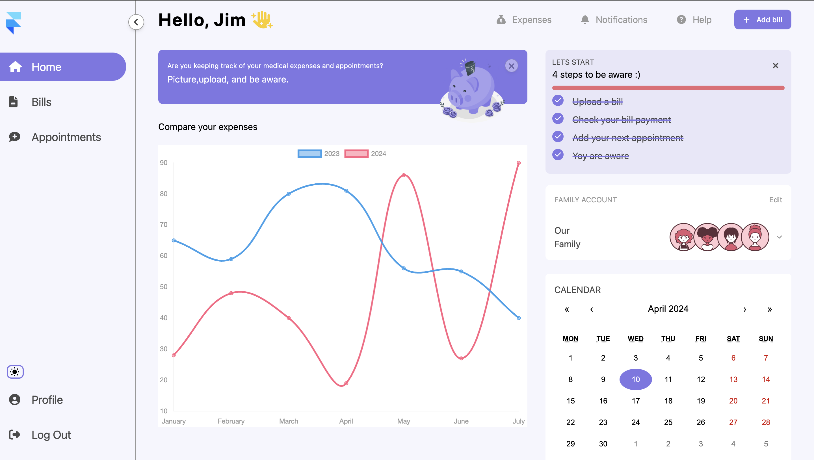
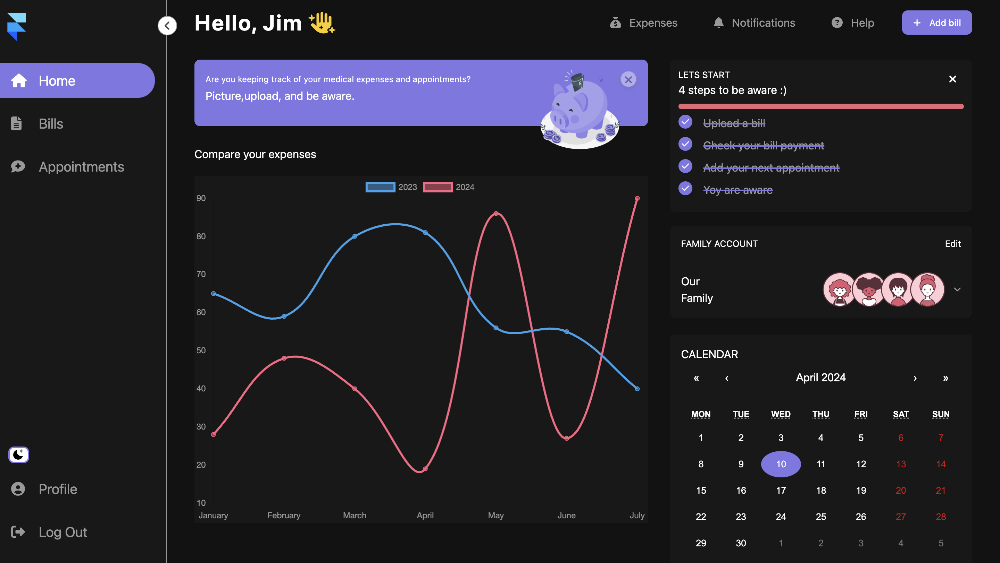
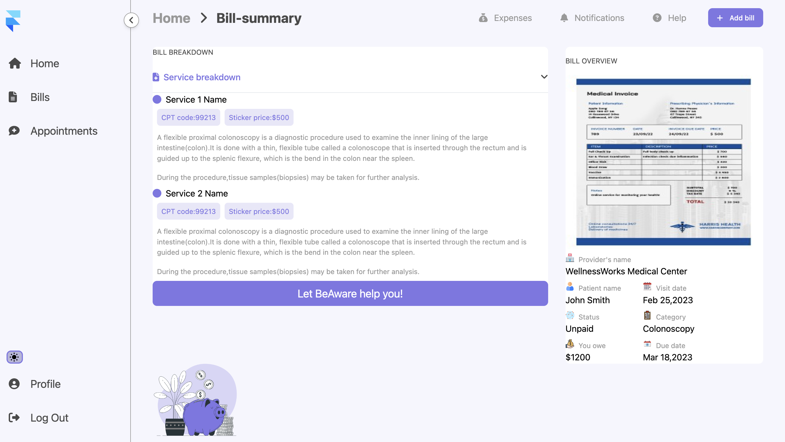

# Health App

## 📝 Description

This dashboard is designed for families to track their medical appointments, monitor their medical expenses, and receive reminders to stay informed and organized. Users can conveniently compare their expenditures over time, manage upcoming appointments, and set reminders to ensure they stay up-to-date and never miss important events.

### 🎮 Functionality:

- Home Page:  The main page where users can get an overview of their family's medical information.
              Displays a summary of upcoming medical appointments and expenses.

- Bills Page: A page dedicated to tracking medical bills and expenses.
              Allows users to view the history of bills and analyze their status (paid/unpaid).
              Provides a "View" button for each bill, enabling users to access detailed information about the bill, including procedure descriptions and other relevant details.

- Appointment Page: A page for managing medical appointments.
                    Enables users to view upcoming doctor visits, schedule new appointments, and manage existing ones.

- Profile Page: A profile page where users can manage personal information and family member data.
                Allows adding new family members, updating their medical and contact information, and configuring notification preferences.

## 🛠️ Technology Stack

- React
- HTML
- CSS
- TypeScript 
- Tailwind

## 📜 Available Scripts

In the project directory, you can run:

### `npm start` ▶️

Runs the app in the development mode.\
Open [http://localhost:3000/](http://localhost:3000/) to view it in the browser.

### `testing deployment` ▶️

Open [https://precious-mochi-becaaa.netlify.app/](https://precious-mochi-becaaa.netlify.app/) to view it in the browser.

## 🚀 Getting Started

To set up and run the project locally, follow these steps:

1. Clone the repository: `git@github.com:papryca/Health-app.git`
2. Navigate to the project directory: `cd health-app`
3. Install dependencies: `npm install`
4. Start the development server: `npm start`

The application will open in your default browser, allowing you to explore and interact with it.

### `Screenshot`

